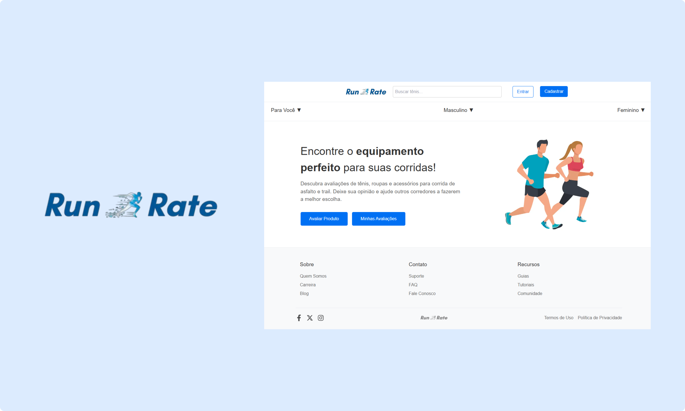

# 🛍️ Plataforma de Avaliação de Produtos



Uma plataforma de avaliação de produtos construída com Next.js onde os usuários podem:
- ✨ Avaliar e comentar sobre produtos
- 🔍 Explorar avaliações de outros usuários
- 👍 Reagir às avaliações

## 🚀 Tecnologias Utilizadas


## 📌 Estado Atual

✅ Funcionalidades básicas implementadas  
✅ Sistema de layouts múltiplos  
✅ Script personalizado para criação de logins  
⏳ Necessita melhorias no design responsivo  
⏳ Barra de navegação precisa ser redesenhada  
⏳ Sistema de autenticação precisa ser aprimorado
⏳ Iniciar área logada e suas funcionalidades 

## 🛠️ Instruções de Configuração

1. Clone o repositório:
```bash
git clone https://github.com/seu-usuario/plataforma-avaliacoes.git
```

2. Instale as dependências:
```bash
npm install
```

3. Execute as migrations:
```bash
npx prisma migrate dev
```

4. Inicie o servidor de desenvolvimento:
```bash
npm run dev
```


## 📅 Melhorias Planejadas
- Implementar design responsivo
- Redesenhar a barra de navegação
- Migrar para Firebase Auth
- Adicionar sistema de reações
- Implementar busca de produtos

## ⚠️ Limitações Atuais
- Sistema de autenticação básico
- Gerenciamento de sessões não otimizado
- Interface precisa ser aprimorada
- Estrutura do banco de dados pode ser otimizada


## 📄 Licença
Este projeto está sob a licença MIT. Veja o arquivo LICENSE para mais detalhes.

Feito com ❤️ por Dutra